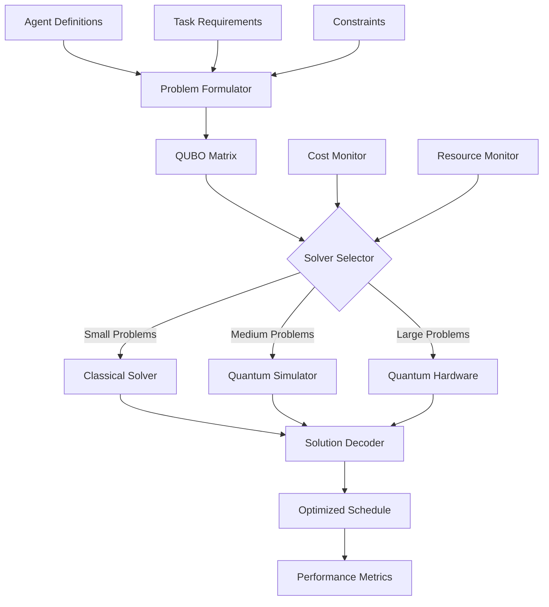

# Architecture Documentation

## System Overview

The Quantum Agent Scheduler is a hybrid classical-quantum system designed for optimizing multi-agent task assignment using quantum computing technologies. The system automatically formulates scheduling problems as QUBO (Quadratic Unconstrained Binary Optimization) problems and leverages various quantum backends for solving.

## Core Components

### 1. Problem Formulation Layer
- **QUBO Builder**: Converts agent-task assignment problems into quantum-compatible format
- **Constraint Handler**: Manages scheduling constraints (deadlines, skill matching, capacity)
- **Problem Analyzer**: Determines optimal solver strategy based on problem characteristics

### 2. Solver Layer
- **Classical Solvers**: Traditional optimization algorithms for small problems
- **Quantum Simulators**: Classical simulation of quantum algorithms for medium problems
- **Quantum Hardware**: Real quantum processors for large-scale optimization

### 3. Backend Abstraction Layer
- **AWS Braket**: D-Wave annealing and gate-based quantum systems
- **IBM Quantum**: Qiskit-based gate quantum computing
- **Azure Quantum**: Microsoft quantum cloud services
- **D-Wave**: Direct quantum annealing access

### 4. Integration Layer
- **CrewAI Plugin**: Native integration with CrewAI framework
- **AutoGen Plugin**: Multi-agent conversation optimization
- **Claude-Flow Plugin**: Quantum-optimized AI workflow scheduling

### 5. Observability Layer
- **Performance Metrics**: Quantum advantage tracking and cost analysis
- **Monitoring**: Real-time solver performance and resource utilization
- **Visualization**: Schedule Gantt charts, resource heatmaps, quantum circuits

## Data Flow Architecture

## Design Principles

### 1. Hybrid-First Approach
- Automatic selection between classical and quantum solvers
- Graceful degradation when quantum resources unavailable
- Cost-aware optimization to prevent expensive quantum calls for trivial problems

### 2. Backend Agnostic
- Abstract interface supporting multiple quantum providers
- Unified API regardless of underlying quantum technology
- Pluggable architecture for new quantum backends

### 3. Framework Integration
- Native plugins for popular multi-agent frameworks
- Minimal code changes required for integration
- Backward compatibility with existing agent workflows

### 4. Performance Transparency
- Real-time metrics on quantum vs classical performance
- Cost tracking and budget management
- Clear reporting on when quantum advantage is achieved

## Quantum Computing Integration

### QUBO Formulation Strategy
The system converts multi-agent scheduling into a binary optimization problem suitable for quantum annealing:

1. **Variables**: Binary variables x_{i,j} where 1 indicates task i assigned to agent j
2. **Objective**: Minimize total completion time, maximize resource utilization
3. **Constraints**: One task per agent, skill matching, capacity limits

### Quantum Advantage Scenarios
- **Large Problem Sizes**: >100 agents/tasks where classical methods become intractable
- **Complex Constraints**: Multiple interdependent constraints that benefit from quantum parallelism
- **Real-time Scheduling**: Time-critical decisions where quantum speedup provides operational value

### Fallback Mechanisms
- Automatic timeout and fallback to classical solvers
- Budget-aware solver selection to prevent cost overruns
- Hybrid approaches using quantum for optimization and classical for refinement

## Security Considerations

### Data Protection
- No sensitive data stored on quantum systems
- Encrypted communication with all quantum backends
- Audit logging for all quantum compute operations

### Access Control
- API key management for quantum provider access
- Role-based access to different backend resources
- Cost controls to prevent unauthorized usage

### Compliance
- GDPR compliance for agent and task data
- SOC 2 Type II controls for quantum provider integration
- Export control compliance for quantum computing technologies

## Scalability Design

### Horizontal Scaling
- Stateless service design enables multiple scheduler instances
- Load balancing across quantum backends
- Queue-based job management for high-throughput scenarios

### Performance Optimization
- Intelligent caching of QUBO formulations
- Precompiled quantum circuits for common problem patterns
- Adaptive timeout strategies based on problem complexity

## Future Architecture Evolution

### Planned Enhancements
1. **Multi-objective Optimization**: Support for Pareto-optimal solutions
2. **Dynamic Rescheduling**: Real-time adaptation to changing conditions
3. **Federated Quantum**: Cross-provider optimization for best performance
4. **ML-Enhanced Selection**: Machine learning for optimal solver selection

### Research Directions
1. **Variational Quantum Algorithms**: VQE and QAOA implementations
2. **Quantum Machine Learning**: Agent behavior prediction using quantum ML
3. **Distributed Quantum**: Multi-QPU parallel processing
4. **Quantum Networking**: Inter-quantum system communication protocols