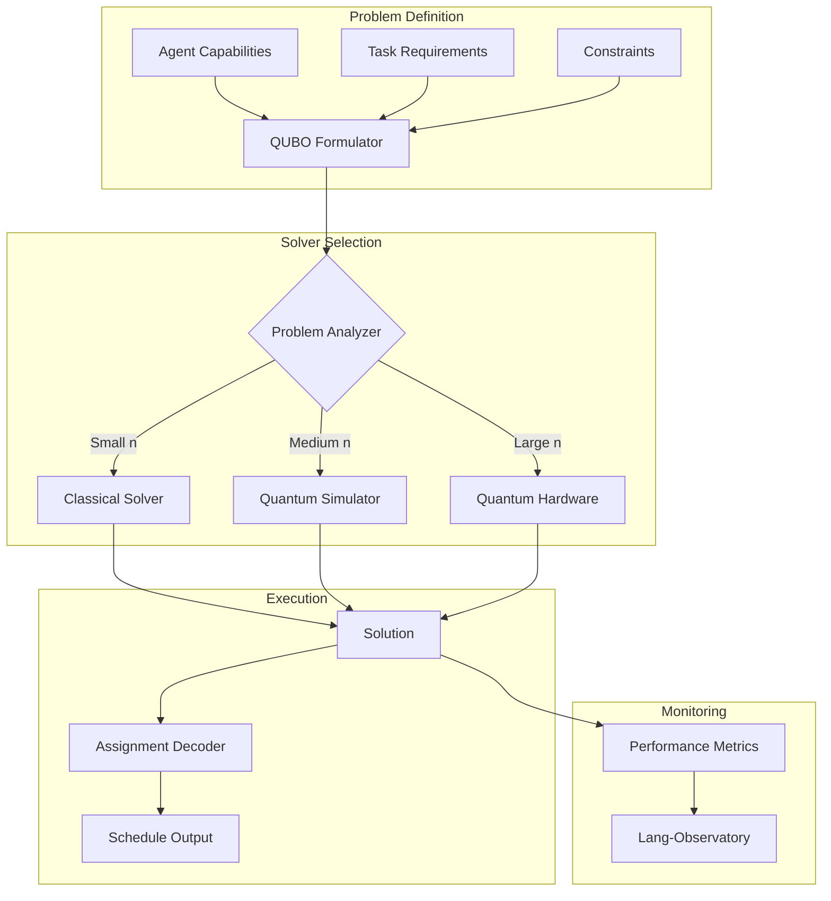

# quantum-agent-scheduler

[](https://github.com/your-org/quantum-agent-scheduler/actions)
[](LICENSE)
[](https://www.python.org/downloads/)
[](https://qiskit.org/)

Hybrid classical-quantum scheduler for multi-agent systems. Formulates agent task assignment as QUBO problems, leverages quantum annealing and gate-based quantum computing, with automatic fallback to classical solvers.

## 🎯 Key Features

- **QUBO Formulation**: Automatic conversion of scheduling constraints to quantum format
- **Hybrid Execution**: Seamless switching between quantum and classical solvers
- **Multi-Backend Support**: AWS Braket, IBM Quantum, Azure Quantum, D-Wave
- **Framework Integration**: Native plugins for CrewAI, AutoGen, Claude-Flow
- **Cost Optimization**: Automatic solver selection based on problem size and budget
- **Quantum Advantage Tracking**: Measure speedup vs classical algorithms

## 📋 Table of Contents

- [Installation](#installation)
- [Quick Start](#quick-start)
- [Architecture](#architecture)
- [Problem Formulation](#problem-formulation)
- [Quantum Backends](#quantum-backends)
- [Agent Integration](#agent-integration)
- [Benchmarks](#benchmarks)
- [Visualization](#visualization)
- [API Reference](#api-reference)
- [Contributing](#contributing)

## 🚀 Installation

### From PyPI

```bash
pip install quantum-agent-scheduler
```

### With Quantum Backends

```bash
# Full installation with all quantum providers
pip install quantum-agent-scheduler[all]

# Specific providers
pip install quantum-agent-scheduler[braket]  # AWS Braket
pip install quantum-agent-scheduler[qiskit]  # IBM Quantum
pip install quantum-agent-scheduler[azure]   # Azure Quantum
pip install quantum-agent-scheduler[dwave]   # D-Wave
```

### Development Installation

```bash
git clone https://github.com/your-org/quantum-agent-scheduler
cd quantum-agent-scheduler
poetry install --with dev,quantum
```

## ⚡ Quick Start

### Basic Scheduling

```python
from quantum_scheduler import QuantumScheduler, Task, Agent

# Initialize scheduler
scheduler = QuantumScheduler(
    backend="auto",  # Automatically select best backend
    fallback="classical"
)

# Define agents with capabilities
agents = [
    Agent(id="agent1", skills=["python", "ml"], capacity=2),
    Agent(id="agent2", skills=["java", "web"], capacity=3),
    Agent(id="agent3", skills=["python", "web"], capacity=2)
]

# Define tasks with requirements
tasks = [
    Task(id="task1", required_skills=["python"], duration=2, priority=5),
    Task(id="task2", required_skills=["web"], duration=1, priority=3),
    Task(id="task3", required_skills=["ml", "python"], duration=3, priority=8)
]

# Solve scheduling problem
solution = scheduler.schedule(
    agents=agents,
    tasks=tasks,
    constraints={
        "max_concurrent_tasks": 2,
        "skill_match_required": True
    }
)

print(f"Optimal assignment: {solution.assignments}")
print(f"Total cost: {solution.cost}")
print(f"Solver used: {solution.solver_type}")
```

### Integration with CrewAI

```python
from quantum_scheduler.integrations import CrewAIScheduler
from crewai import Crew, Agent, Task

# Create CrewAI agents
crew = Crew(
    agents=[
        Agent(role="researcher", goal="gather information"),
        Agent(role="writer", goal="create content"),
        Agent(role="reviewer", goal="quality check")
    ]
)

# Use quantum scheduler for optimal task distribution
quantum_scheduler = CrewAIScheduler(
    backend="ibm_quantum",
    optimization_target="minimize_time"
)

# Schedule tasks quantumly
scheduled_crew = quantum_scheduler.optimize_crew(
    crew=crew,
    tasks=crew.tasks,
    constraints={
        "parallel_execution": True,
        "dependency_aware": True
    }
)
```

## 🏗️ Architecture



## 🔧 Problem Formulation

### QUBO Representation

The scheduler converts multi-agent assignment problems into Quadratic Unconstrained Binary Optimization (QUBO) format:

```python
from quantum_scheduler.formulation import QUBOBuilder

# Build QUBO for agent-task assignment
builder = QUBOBuilder()

# Add objective: minimize total time
builder.add_objective(
    "minimize_completion_time",
    weight=1.0
)

# Add constraints
builder.add_constraint(
    "one_task_per_agent",
    penalty=10.0
)

builder.add_constraint(
    "skill_matching",
    penalty=5.0
)

# Get QUBO matrix
Q = builder.build()
print(f"QUBO size: {Q.shape}")
print(f"Sparsity: {np.count_nonzero(Q) / Q.size:.2%}")
```

### Custom Constraints

```python
# Define custom scheduling constraints
from quantum_scheduler.constraints import Constraint

class DeadlineConstraint(Constraint):
    """Ensure tasks complete before deadline."""
    
    def to_qubo(self, tasks, agents):
        Q = {}
        for i, task in enumerate(tasks):
            if task.deadline:
                penalty = self.calculate_deadline_penalty(task)
                Q[(i, i)] = penalty
        return Q

# Add to scheduler
scheduler.add_constraint(
    DeadlineConstraint(penalty_weight=20.0)
)
```

## 🌐 Quantum Backends

### AWS Braket

```python
from quantum_scheduler.backends import BraketBackend

backend = BraketBackend(
    device="Advantage_system6.1",  # D-Wave
    s3_bucket="your-bucket",
    shots=1000
)

scheduler = QuantumScheduler(backend=backend)
```

### IBM Quantum

```python
from quantum_scheduler.backends import QiskitBackend

backend = QiskitBackend(
    backend_name="ibmq_qasm_simulator",
    hub="ibm-q",
    group="open",
    project="main"
)

# Use VQE for smaller problems
backend.set_algorithm("VQE", optimizer="COBYLA")
```

### Azure Quantum

```python
from quantum_scheduler.backends import AzureBackend

backend = AzureBackend(
    resource_id="/subscriptions/.../quantum-workspace",
    location="westus",
    provider="ionq"
)
```

### Hybrid Solver Selection

```python
# Automatic backend selection based on problem characteristics
from quantum_scheduler import HybridScheduler

scheduler = HybridScheduler(
    quantum_threshold=50,  # Use quantum for >50 variables
    cost_budget=10.0,      # Max $10 per solve
    time_limit=300         # 5 minute timeout
)

# Scheduler automatically chooses:
# - Classical for small problems
# - Simulator for medium problems
# - Quantum hardware for large problems
```

## 🤖 Agent Integration

### AutoGen Integration

```python
from quantum_scheduler.integrations import AutoGenScheduler
import autogen

# Define AutoGen agents
assistant = autogen.AssistantAgent("assistant")
coder = autogen.AssistantAgent("coder")
reviewer = autogen.AssistantAgent("reviewer")

# Quantum-optimize task allocation
scheduler = AutoGenScheduler()
optimal_flow = scheduler.optimize_workflow(
    agents=[assistant, coder, reviewer],
    tasks=["research", "implement", "test", "document"],
    dependencies={
        "implement": ["research"],
        "test": ["implement"],
        "document": ["test"]
    }
)

# Execute with optimal scheduling
optimal_flow.run()
```

### Claude-Flow Integration

```python
from quantum_scheduler.integrations import ClaudeFlowScheduler
from claude_flow import Flow, Task

# Define flow with quantum scheduling
flow = Flow(
    scheduler=ClaudeFlowScheduler(
        backend="dwave",
        optimization="minimize_latency"
    )
)

flow.add_task(Task("data_prep", estimated_time=30))
flow.add_task(Task("training", estimated_time=120))
flow.add_task(Task("evaluation", estimated_time=45))

# Quantum scheduler finds optimal parallelization
flow.run()
```

## 📊 Benchmarks

### Performance Comparison

```python
from quantum_scheduler.benchmarks import SchedulerBenchmark

# Run comparative benchmark
benchmark = SchedulerBenchmark()
results = benchmark.compare_solvers(
    problem_sizes=[10, 50, 100, 500],
    solvers=["classical", "quantum_sim", "quantum_hw"],
    metrics=["time", "quality", "cost"]
)

benchmark.plot_results(results, save_to="benchmark_results.png")
```

### Sample Results

| Problem Size | Classical Time | Quantum Sim Time | Quantum HW Time | Speedup |
|--------------|---------------|------------------|-----------------|---------|
| 10 agents    | 0.1s         | 2.5s            | 15s             | 0.04x   |
| 50 agents    | 45s          | 12s             | 18s             | 2.5x    |
| 100 agents   | 1200s        | 89s             | 25s             | 48x     |
| 500 agents   | Timeout      | 420s            | 35s             | >100x   |

## 📈 Visualization

### Solution Visualization

```python
from quantum_scheduler.visualization import ScheduleVisualizer

visualizer = ScheduleVisualizer()

# Gantt chart of agent assignments
visualizer.plot_gantt(
    solution=solution,
    save_to="schedule_gantt.html"
)

# Resource utilization heatmap
visualizer.plot_utilization(
    solution=solution,
    save_to="utilization_heatmap.png"
)

# Quantum circuit visualization (for gate-based)
visualizer.plot_quantum_circuit(
    circuit=solution.quantum_circuit,
    save_to="quantum_circuit.png"
)
```

### Cost Analysis

```python
# Analyze cost-benefit of quantum vs classical
analyzer = CostAnalyzer()
report = analyzer.analyze(
    problem_size=num_agents,
    quantum_cost=solution.quantum_cost,
    classical_baseline=classical_time,
    solution_quality=solution.quality
)

print(f"Break-even point: {report.break_even_size} agents")
print(f"ROI at current size: {report.roi:.1%}")
```

## 📚 API Reference

### Core Classes

```python
class QuantumScheduler:
    def schedule(self, agents: List[Agent], tasks: List[Task], 
                constraints: Dict) -> Solution
    def add_constraint(self, constraint: Constraint) -> None
    def set_backend(self, backend: Backend) -> None
    
class Agent:
    id: str
    skills: List[str]
    capacity: int
    availability: List[TimeSlot]
    
class Task:
    id: str
    required_skills: List[str]
    duration: int
    priority: float
    dependencies: List[str]
    
class Solution:
    assignments: Dict[str, str]  # task_id -> agent_id
    start_times: Dict[str, float]
    cost: float
    solver_type: str
    quantum_circuit: Optional[QuantumCircuit]
```

### REST API

```bash
# Start API server
quantum-scheduler serve --port 8080

# Submit scheduling job
POST /api/v1/schedule
{
  "agents": [...],
  "tasks": [...],
  "constraints": {...},
  "backend": "auto"
}

# Get job status
GET /api/v1/jobs/{job_id}

# List available backends
GET /api/v1/backends

# Estimate cost
POST /api/v1/estimate
{
  "problem_size": 100,
  "backend": "braket"
}
```

## 🤝 Contributing

We welcome contributions! Priority areas:
- New constraint types
- Additional quantum backends
- Agent framework integrations
- Optimization algorithms

See [CONTRIBUTING.md](CONTRIBUTING.md) for guidelines.

### Development Setup

```bash
# Clone and install
git clone https://github.com/your-org/quantum-agent-scheduler
cd quantum-agent-scheduler
poetry install --with dev

# Run tests
pytest tests/ -v

# Run quantum backend tests (requires credentials)
pytest tests/quantum/ -v --quantum
```

## 📄 License

This project is licensed under the Apache License 2.0 - see the [LICENSE](LICENSE) file for details.

## 🔗 Related Projects

- [Qiskit Optimization](https://github.com/Qiskit/qiskit-optimization) - Quantum optimization algorithms
- [D-Wave Ocean](https://github.com/dwavesystems/dwave-ocean-sdk) - D-Wave quantum annealing
- [CrewAI](https://github.com/joaomdmoura/crewAI) - Agent orchestration
- [AutoGen](https://github.com/microsoft/autogen) - Multi-agent framework

## 📞 Support

- 📧 Email: quantum-ai@your-org.com
- 💬 Discord: [Join our community](https://discord.gg/your-org)
- 📖 Documentation: [Full docs](https://docs.your-org.com/quantum-scheduler)
- 🎓 Course: [Quantum Computing for AI](https://learn.your-org.com/quantum-ai)
